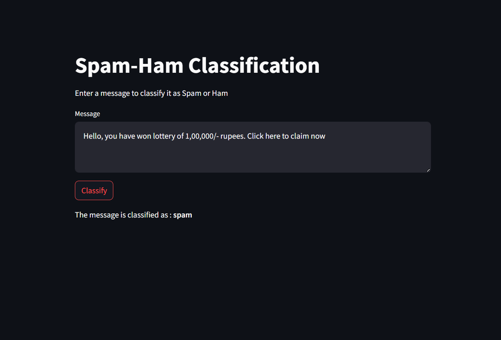
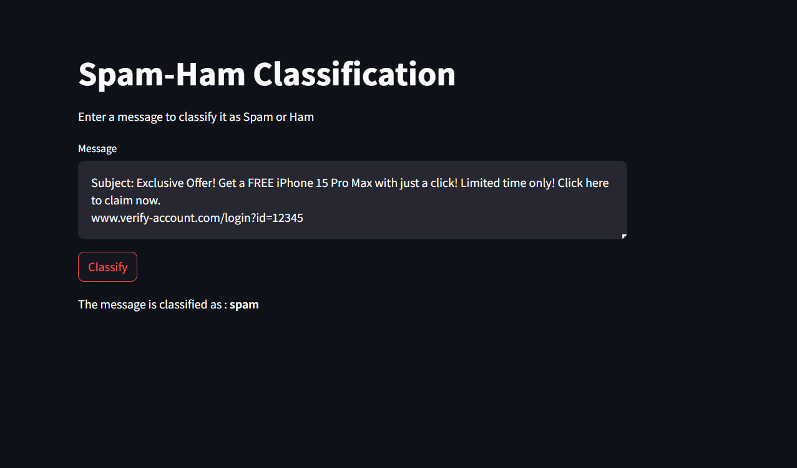
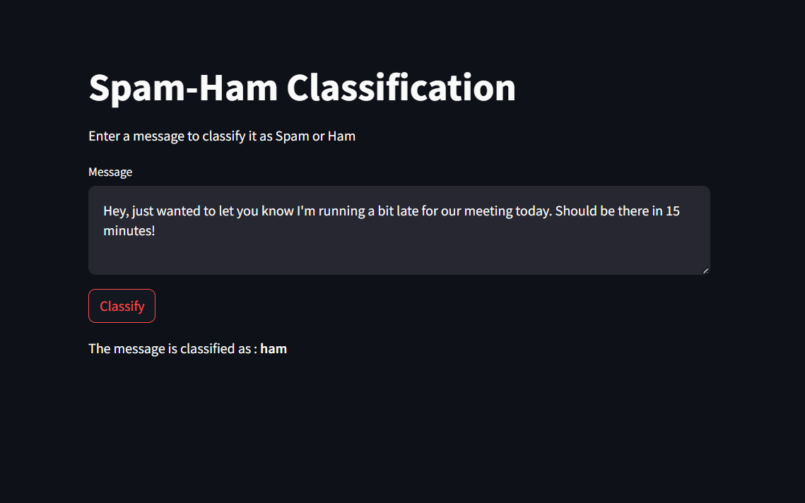
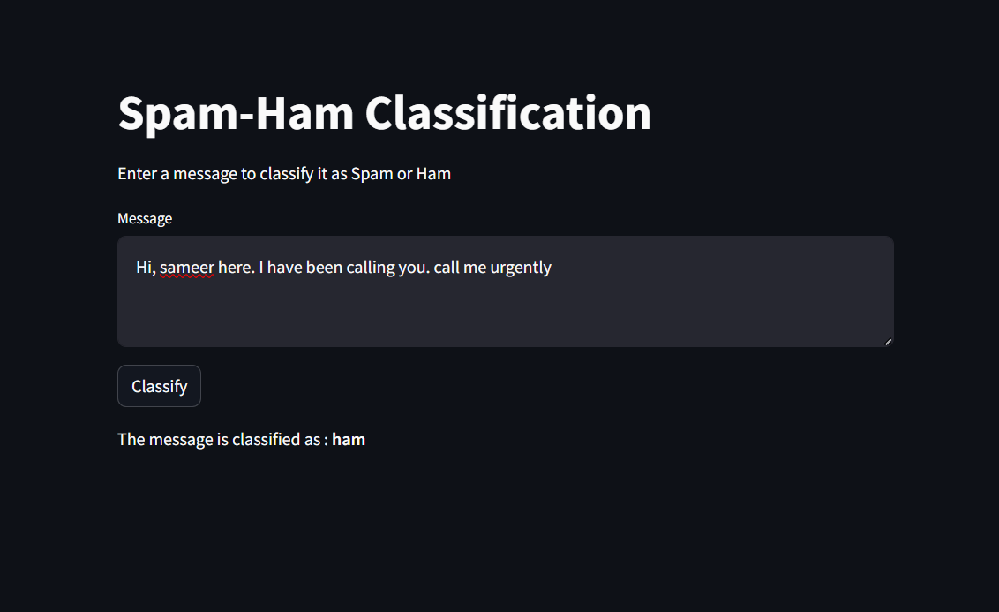

📧 Email Spam-Ham Classifier Using NLP 🧠✨
The Email Spam-Ham Classifier is a Natural Language Processing (NLP) project designed to identify and classify messages as either Spam or Ham (Not Spam). This project combines data preprocessing, feature extraction, and machine learning to create a robust and efficient classification system.

🎯 Goal
To build a reliable spam detection model that classifies emails and messages, ensuring effective filtering of unwanted content while maintaining accuracy and usability.

🎯 Objectives
Preprocess and clean textual data to extract meaningful features.
Apply advanced NLP techniques for vectorization and representation.
Train and evaluate machine learning models for optimal spam-ham classification.
Deploy the model using Flask and Streamlit for real-world usability.
🤔 Why This Project?
Spam emails and messages clutter inboxes, waste time, and pose security risks. This project aims to address these issues by providing an automated solution to detect and filter out spam efficiently. It ensures that important communications remain undisturbed while blocking malicious or irrelevant content.

## Screenshots

### Spam Mail
When we get the Spam mail

### Ham Mail
When we get the Ham mail

💼 Description
The project is built using NLP techniques and machine learning algorithms to classify email messages into two categories: Spam or Ham. The pipeline includes:

Data Preprocessing:

Removed stopwords, special characters, and unnecessary spaces.
Tokenized and stemmed words for meaningful representation.
Feature Extraction:

Used TF-IDF Vectorization to convert text into numerical features.
Model Training:

Trained models including Logistic Regression, Decision Tree, and Random Forest.
Achieved high accuracy using the Random Forest Classifier.
Deployment:

Deployed using Flask and Streamlit for easy user interaction.

🌟 Results
Accuracy Achieved:
* Random Forest Classifier: 96%
* Logistic Regression: 94%
* Decision Tree: 92%
* 
Key Features:
Handles real-time user input for classification.
Efficiently filters out spam with minimal false positives.

🔧 Technologies Used
Languages: Python
Libraries: Pandas, Numpy, Scikit-learn, Streamlit, Flask, Pickle
NLP Techniques: TF-IDF Vectorization, Tokenization, Text Preprocessing
Models: Logistic Regression, Decision Tree, Random Forest.

📈 Key Metrics
* Accuracy: 96% (Random Forest Classifier)
* Precision: High precision for spam detection to minimize false positives.
* Recall: Reliable recall to ensure legitimate messages are not flagged as spam.

🚀 Deployment
* Flask Web Application
* Streamlit 
